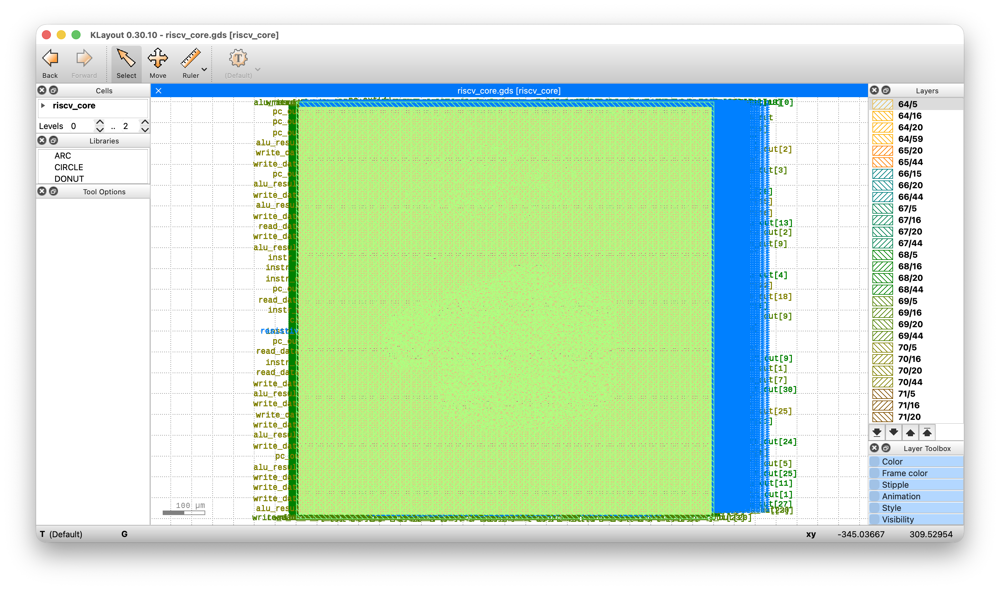

# RISC-V Core — ASIC Physical Implementation

A custom 32-bit single-cycle RISC-V (RV32I) processor core, taken from RTL
through to a fully routed, DRC/LVS-clean GDSII layout on the open-source
SkyWater 130nm PDK.

| | |
|---|---|
| **ISA**                    | RV32I (single-cycle datapath) |
| **PDK**                    | SkyWater SKY130 (`sky130A`) |
| **Standard cell library**  | `sky130_fd_sc_hd` |
| **Flow**                   | [OpenLane](https://github.com/The-OpenROAD-Project/OpenLane) v1.0.2 |
| **Die area**                | 1.0 mm × 1.0 mm |
| **Target clock period**    | 20 ns (50 MHz) |

## Architecture

The core implements a classic single-cycle RV32I datapath, split across the
following RTL modules:

| Module          | Description                                   |
|------------------|------------------------------------------------|
| `riscv_core.sv`  | Top-level integration of all submodules        |
| `control.sv`     | Instruction decoder / control unit             |
| `datapath.sv`    | Register file, ALU muxing, PC update logic     |
| `alu.sv`         | Arithmetic logic unit                          |
| `regfile.sv`     | 32 × 32-bit register file                      |
| `pc.sv`          | Program counter                                |
| `imem.sv`        | Instruction memory                             |
| `dmem.sv`        | Data memory                                    |

## Repository Structure

.
├── config.json # OpenLane flow configuration
├── src/ # RTL sources (SystemVerilog)
│ ├── riscv_core.sv
│ ├── control.sv
│ ├── datapath.sv
│ ├── alu.sv
│ ├── regfile.sv
│ ├── pc.sv
│ ├── imem.sv
│ └── dmem.sv
├── riscv_core.gds # Final signed-off GDSII layout
├── klayout_gds_file_screenshot.png
└── README.md


## Physical Design (GDSII)

The core was synthesized, placed, clock-tree-synthesized, routed, and signed
off end-to-end using OpenLane targeting the SkyWater 130nm PDK.


*Final GDSII layout, viewed in KLayout.*

## Results

Signoff summary for the final completed run:

| Metric                            | Result                       |
|-------------------------------------|-------------------------------|
| DRC violations                    | 0                             |
| LVS errors                        | 0                             |
| Antenna violations                | 2 (residual, non-blocking)    |
| Setup violations                  | 0                             |
| Hold violations                   | 0                             |
| Post-synthesis standard cells     | ~8,800                        |
| Core area                         | ~0.97 mm²                     |
| Critical path                     | 9.08 ns (constraint: 20 ns)   |

## Reproducing the Flow

This design targets [OpenLane](https://github.com/The-OpenROAD-Project/OpenLane)
v1.0.2 with the SKY130 PDK installed via
[ciel](https://github.com/fossi-foundation/ciel). Place `config.json` and
`src/` under `designs/riscv_core/` inside an OpenLane checkout, then:

```bash
make mount
```

Inside the container:

```bash
./flow.tcl -design riscv_core
```

## Known Limitations

- Single-cycle implementation — no pipelining, no hazard handling.
- `riscv_core.sv` exposes internal observability ports (`pc_out`,
  `instr_out`, `alu_result_out`, etc.) required to prevent synthesis from
  eliminating unreachable logic in the absence of a real external
  memory-mapped interface. A production version would replace these with a
  proper bus interface.
- No formal verification or testbench included yet.

## License

[Add your license here — e.g. MIT, Apache 2.0]

## Acknowledgments

- [OpenLane](https://github.com/The-OpenROAD-Project/OpenLane) /
  [OpenROAD](https://github.com/The-OpenROAD-Project/OpenROAD)
- [SkyWater Open Source PDK](https://github.com/google/skywater-pdk)
- [ciel](https://github.com/fossi-foundation/ciel) PDK manager
